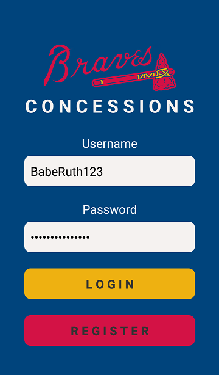
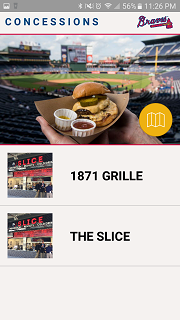
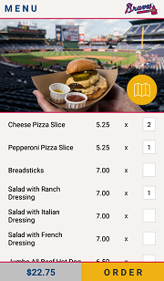
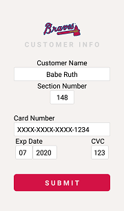
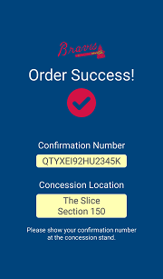

# Braves Concessions

Braves Concessions is a mobile app born from the Atlanta Braves Hackathon at SunTrust Park. It allows baseball fans to put in mobile orders and pick up food from the nearest concession stand.

The app is still in its development phase and is not yet available in the public domain. It is currently in the process of being implemented with an admin system (web application) for vendors to keep track of consumer orders.

## Application Usage
The objective of the Atlanta Braves Hackathon was to increase consumer engagement with SunTrust Park that opened in March 2017.

The purpose of Braves Concessions is to make ordering food easier for consumers at the SunTrust Park on game days.

**After registration, the user logs in with credentials.**

**The user selects a vendor.**

**The user inputs a quantity for desired menu items.**

**The user inputs their payment information.**

**If the order was successful, a confirmation page should appear.**

## Development Implementations
MERN stack
- MongoDB
- Express.js
- React Native
- Node.js

| Node Package        | Version |
|---------------------|---------|
| axios | 0.16.2 |
| babel-jest | 21.0.2 |
| babel-preset-react-native | 3.0.2 |
| bcryptjs | 2.4.3 |
| body-parser | 1.18.0 |
| cloudinary | 1.9.0 |
| connect-flash | 0.1.1 |
| cookie-parser | 1.4.3 |
| dotenv | 4.0.0 |
| expo | 20.0.0  |
| express | 4.15.4 |
| express-session | 1.15.5 |
| jest | 21.0.2 |
| jest-expo | ~20.0.0 |
| jquery | 3.2.1 |
| mocha | 3.5.3 |
| mongoose | 4.11.10 |
| morgan | 1.8.2 |
| passport | 0.4.0 |
| passport-local | 1.0.0 |
| react | 16.0.0-alpha.12  |
| react-native | 0.47.0 |
| react-native-keyboard-aware-scroll-view | 0.3.0 |
| react-native-photo-view | 1.4.0 |
| react-native-router-flux | 4.0.0-beta.21 |
| react-native-scripts | 1.3.1 |
| react-navigation | 1.0.0-beta.11  |
| react-test-renderer| 16.0.0-alpha.12 |
| request | 2.81.0  |

## Contributing
Braves Concessions is currently not open to contributions. Thank you for your interest!
